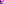
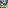
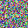
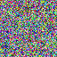
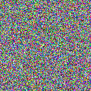
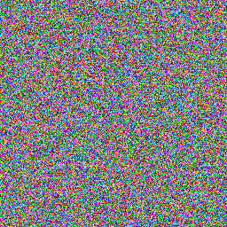

# 06. JPG 노이즈 특성 분석

> 다양한 크기의 JPG 노이즈 이미지 파일의 특성을 분석하고 비교합니다.

## 🔬 실험 개요

- **목표:**
- **가설:**
- **실험 방법:**

## 📊 변환 결과

<!-- RESULT_TABLE_START -->
### 결과 요약

| 파일명 | 포맷 | 해상도 | 용량 |
|:---|:---|:---|:---|
|  | jpeg | 4x4 | 0.39 KB |
|  | jpeg | 8x8 | 0.40 KB |
|  | jpeg | 16x16 | 0.74 KB |
|  | jpeg | 32x32 | 2.05 KB |
|  | jpeg | 64x64 | 7.29 KB |
|  | jpeg | 128x128 | 28.21 KB |
|  | jpeg | 256x256 | 111.96 KB |

<!-- RESULT_TABLE_END -->

## ✅ 결론

- **분석:**
- **결론:**
