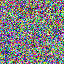

# 10. JPG to WebP Noise Comparison

> JPG 노이즈 이미지를 다양한 품질의 WebP로 변환하여 파일 크기와 특성을 비교합니다.

## 🔬 실험 개요

- **목표:**
- **가설:**
- **실험 방법:**

## 📊 변환 결과

<!-- RESULT_TABLE_START -->
### noise_4x4.jpg

| 속성 | 원본 (jpeg) |
|:---|:---|
| 미리보기 |  |
| 해상도 | 4x4 |
| 용량 | 0.39 KB |

**변환 결과**

| 포맷 (옵션) | 해상도 | 용량 (원본 대비) | 미리보기 |
|:---|:---|:---|:---|
| webp (quality: 100, lossless: true) | 4x4 | 0.13 KB (-66.50%) |  |
| webp (quality: 75) | 4x4 | 0.07 KB (-81.00%) |  |
| webp (quality: 50) | 4x4 | 0.07 KB (-82.50%) |  |

---

### noise_8x8.jpg

| 속성 | 원본 (jpeg) |
|:---|:---|
| 미리보기 |  |
| 해상도 | 8x8 |
| 용량 | 0.40 KB |

**변환 결과**

| 포맷 (옵션) | 해상도 | 용량 (원본 대비) | 미리보기 |
|:---|:---|:---|:---|
| webp (quality: 100, lossless: true) | 8x8 | 0.31 KB (-21.46%) |  |
| webp (quality: 75) | 8x8 | 0.13 KB (-67.80%) |  |
| webp (quality: 50) | 8x8 | 0.12 KB (-71.22%) |  |

---

### noise_16x16.jpg

| 속성 | 원본 (jpeg) |
|:---|:---|
| 미리보기 |  |
| 해상도 | 16x16 |
| 용량 | 0.74 KB |

**변환 결과**

| 포맷 (옵션) | 해상도 | 용량 (원본 대비) | 미리보기 |
|:---|:---|:---|:---|
| webp (quality: 100, lossless: true) | 16x16 | 1.00 KB (+36.34%) |  |
| webp (quality: 75) | 16x16 | 0.26 KB (-64.46%) |  |
| webp (quality: 50) | 16x16 | 0.22 KB (-70.29%) |  |

---

### noise_32x32.jpg

| 속성 | 원본 (jpeg) |
|:---|:---|
| 미리보기 |  |
| 해상도 | 32x32 |
| 용량 | 2.05 KB |

**변환 결과**

| 포맷 (옵션) | 해상도 | 용량 (원본 대비) | 미리보기 |
|:---|:---|:---|:---|
| webp (quality: 100, lossless: true) | 32x32 | 3.10 KB (+51.31%) |  |
| webp (quality: 75) | 32x32 | 0.81 KB (-60.46%) |  |
| webp (quality: 50) | 32x32 | 0.68 KB (-66.94%) |  |

---

### noise_64x64.jpg

| 속성 | 원본 (jpeg) |
|:---|:---|
| 미리보기 |  |
| 해상도 | 64x64 |
| 용량 | 7.29 KB |

**변환 결과**

| 포맷 (옵션) | 해상도 | 용량 (원본 대비) | 미리보기 |
|:---|:---|:---|:---|
| webp (quality: 100, lossless: true) | 64x64 | 12.10 KB (+66.11%) |  |
| webp (quality: 75) | 64x64 | 2.76 KB (-62.06%) |  |
| webp (quality: 50) | 64x64 | 2.35 KB (-67.72%) |  |

---

### noise_128x128.jpg

| 속성 | 원본 (jpeg) |
|:---|:---|
| 미리보기 |  |
| 해상도 | 128x128 |
| 용량 | 28.21 KB |

**변환 결과**

| 포맷 (옵션) | 해상도 | 용량 (원본 대비) | 미리보기 |
|:---|:---|:---|:---|
| webp (quality: 100, lossless: true) | 128x128 | 47.99 KB (+70.12%) |  |
| webp (quality: 75) | 128x128 | 10.33 KB (-63.39%) |  |
| webp (quality: 50) | 128x128 | 8.87 KB (-68.55%) |  |

---

### noise_256x256.jpg

| 속성 | 원본 (jpeg) |
|:---|:---|
| 미리보기 |  |
| 해상도 | 256x256 |
| 용량 | 111.96 KB |

**변환 결과**

| 포맷 (옵션) | 해상도 | 용량 (원본 대비) | 미리보기 |
|:---|:---|:---|:---|
| webp (quality: 100, lossless: true) | 256x256 | 191.70 KB (+71.22%) |  |
| webp (quality: 75) | 256x256 | 39.98 KB (-64.29%) |  |
| webp (quality: 50) | 256x256 | 34.31 KB (-69.35%) |  |

---
<!-- RESULT_TABLE_END -->

## ✅ 결론

- **분석:**
- **결론:**
