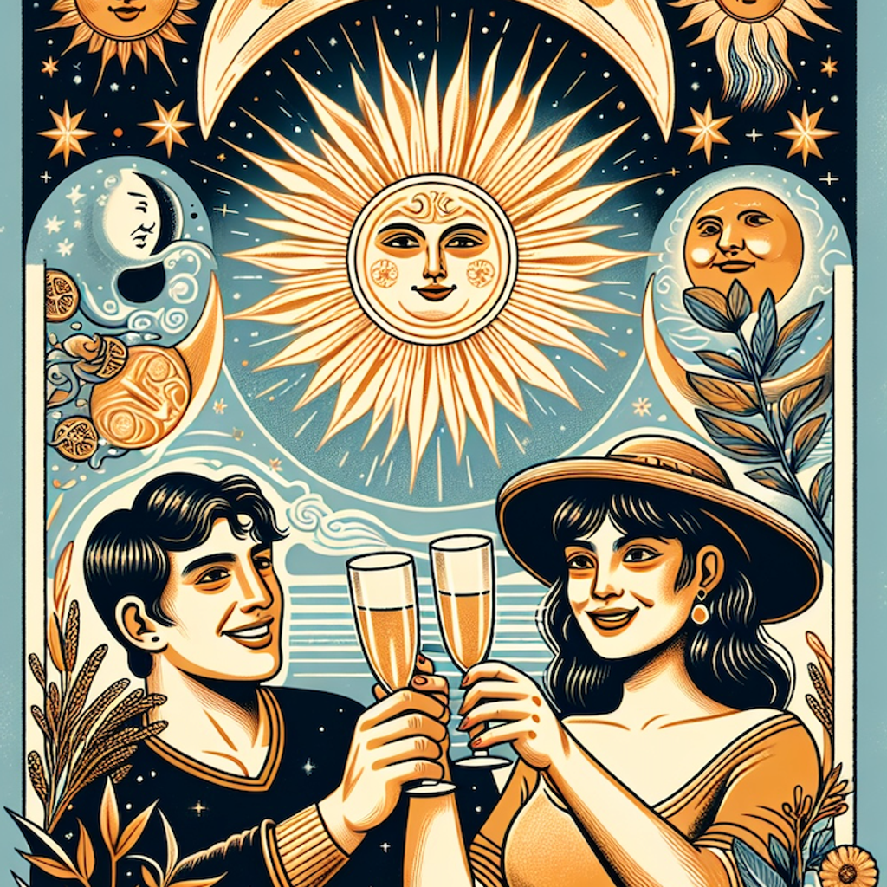

# 11. Portrait Image Compression Comparison

> 리사이즈된 인물 이미지를 WebP와 JPG로 변환하여 압축 효율과 품질을 비교합니다.

## 🔬 실험 개요

- **목표:**
- **가설:**
- **실험 방법:**

## 📊 변환 결과

<!-- RESULT_TABLE_START -->
### ss0607_1024x1024.png

| 속성 | 원본 (png) |
|:---|:---|
| 미리보기 |  |
| 해상도 | 1024x1024 |
| 용량 | 2682.04 KB |

**변환 결과**

| 포맷 (옵션) | 해상도 | 용량 (원본 대비) | 미리보기 |
|:---|:---|:---|:---|
| webp (quality: 75) | 1024x1024 | 168.92 KB (-93.70%) |  |
| webp (quality: 50) | 1024x1024 | 129.40 KB (-95.18%) |  |
| jpg (quality: 75) | 1024x1024 | 259.18 KB (-90.34%) |  |
| jpg (quality: 50) | 1024x1024 | 259.18 KB (-90.34%) |  |

---

### ss0607_256x256.png

| 속성 | 원본 (png) |
|:---|:---|
| 미리보기 |  |
| 해상도 | 256x256 |
| 용량 | 188.25 KB |

**변환 결과**

| 포맷 (옵션) | 해상도 | 용량 (원본 대비) | 미리보기 |
|:---|:---|:---|:---|
| webp (quality: 75) | 256x256 | 24.31 KB (-87.09%) |  |
| webp (quality: 50) | 256x256 | 19.63 KB (-89.57%) |  |
| jpg (quality: 75) | 256x256 | 29.96 KB (-84.08%) |  |
| jpg (quality: 50) | 256x256 | 29.96 KB (-84.08%) |  |

---

### ss0607_512x512.png

| 속성 | 원본 (png) |
|:---|:---|
| 미리보기 |  |
| 해상도 | 512x512 |
| 용량 | 715.26 KB |

**변환 결과**

| 포맷 (옵션) | 해상도 | 용량 (원본 대비) | 미리보기 |
|:---|:---|:---|:---|
| webp (quality: 75) | 512x512 | 73.47 KB (-89.73%) |  |
| webp (quality: 50) | 512x512 | 58.50 KB (-91.82%) |  |
| jpg (quality: 75) | 512x512 | 97.52 KB (-86.37%) |  |
| jpg (quality: 50) | 512x512 | 97.52 KB (-86.37%) |  |

---
<!-- RESULT_TABLE_END -->

## ✅ 결론

- **분석:**
- **결론:**
